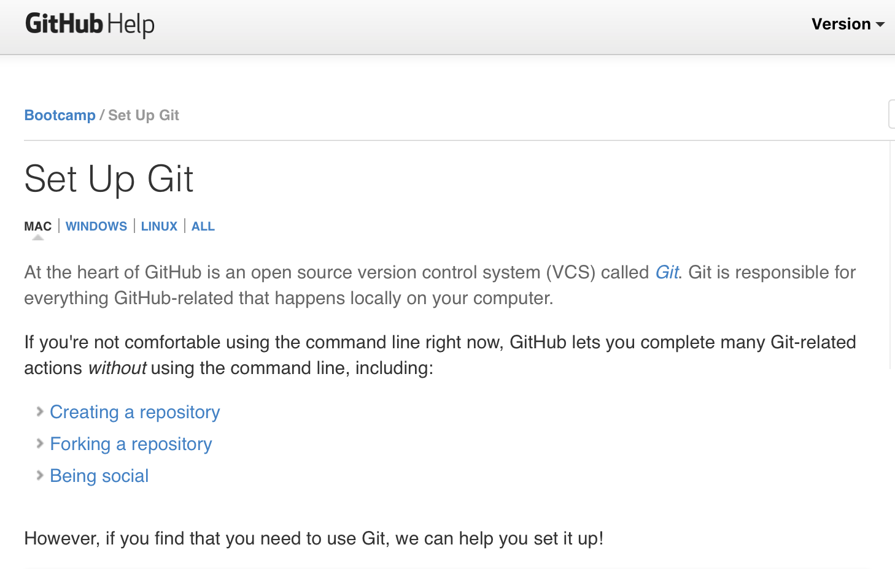

# Set up

Conference wifi can be spotty at times. If you are able to install
these items before Open Source Day, that would be great. If you are not
able we'll have a way for you to do so at the event.

## Editor

You will need to have a code editor installed on your system. There are
many available that are open source. Two user friendly editors are:

- [Atom](https://atom.io)
- [Visual Studio Code](https://code.visualstudio.com/)

## GitHub and git

[GitHub Help pages](https://help.github.com)

1. Create a [GitHub account](https://help.github.com/articles/set-up-git/)
   if you do not already have one.

   
   
2. Make sure git is installed on your system.
3. From the command line (terminal), enter `git --version`. If git is
   installed on your system and its PATH, it will display git's version.
   
   
## Command line (Terminal)

Know how to access a terminal on your system.

## Jupyter Notebook

1. Download the [Anaconda installer](https://www.continuum.io/downloads)
   for your operating system. FYI...most modern computers are 64 bit.

2. Run the installer.

3. Download the [conda cheatsheet](http://conda.pydata.org/docs/_downloads/conda-cheatsheet.pdf)

---

## Documentation, help, and cheatsheets

* Command line basics
    - [cheatsheet]
    - [Advanced cheatsheet](https://digital-forensics.sans.org/media/linux-shell-survival-guide.pdf) Not needed for workshop but handy to have
    - [Django Girls tutorial section on command line and terminal](https://tutorial.djangogirls.org/en/intro_to_command_line/) Highly recommended
    - [Learn Python the Hard Way - Command Line](https://learnpythonthehardway.org/book/appendixa.html)

* GitHub and git
    - [GitHub's git cheatsheet](https://services.github.com/kit/downloads/github-git-cheat-sheet.pdf)
    - [git help](https://git-scm.com/)
    - [GitHub help](https://help.github.com)
    - [You can git!](http://www.slideshare.net/willingc/yes-you-can-git)

* Python basics
    - Django Girls tutorial section on Python
    - [Quick reference to Python](http://www.dataschool.io/python-quick-reference/)

* Conda
    - [conda cheatsheet](http://conda.pydata.org/docs/_downloads/conda-cheatsheet.pdf)
    - [conda documentation](http://conda.pydata.org/docs/)

---

Work in process:

## Goals

- Learn
- Gallery of Humanitarian Notebooks
  * Education - teaching women; access to technical resources; open data
  * Mapping - safe routes, open data community resources
  * Curate existing notebooks on humanitarian causes
- Open Source Day 2017

## Materials

- [Anaconda](https://www.continuum.io/downloads)
- GitHub account
- Git installed on your system
- Basic command line
- Basic git commands

## Resources for mentors

- [You can git!](http://www.slideshare.net/willingc/yes-you-can-git)